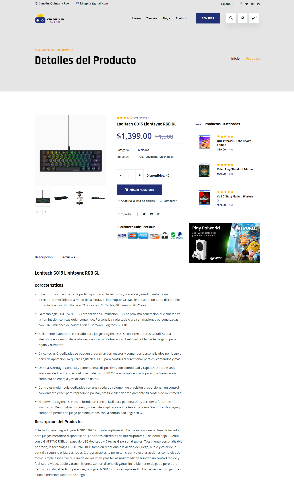

# KingPlus Game Shop

## Descripción

KingPlus Game Shop es una tienda en línea especializada en la venta de videojuegos, consolas y accesorios para gamers. Nuestra misión es ofrecer una experiencia de compra excepcional con una amplia variedad de productos y promociones exclusivas para nuestros clientes.

## Características

- **Blog**: Sección dedicada a artículos y noticias sobre el mundo de los videojuegos. Mantente al día con las últimas novedades, lanzamientos y reseñas de juegos.

- **Artículos**: Información detallada y bien estructurada en cada publicación del blog, cubriendo temas relevantes para los entusiastas del gaming.

- **Tienda**: Navega y compra entre una amplia variedad de productos, incluyendo videojuegos, consolas y accesorios de alta gama.

- **Detalles del Producto**: Página con información exhaustiva sobre cada producto, incluyendo especificaciones técnicas, reseñas de clientes y opciones de personalización.

- **Productos Destacados**: Una selección curada de los productos más populares y recomendados, destacando las mejores opciones disponibles.

- **Ofertas Exclusivas**: Temporizador de cuenta regresiva para promociones especiales, ayudando a los clientes a aprovechar ofertas limitadas en tiempo real.

- **Carrito de Compras**: Funcionalidad completa de carrito de compras, permitiendo a los usuarios agregar productos, revisar cantidades y proceder al pago de manera fácil y rápida.

- **Checkout Page**: Página optimizada para el proceso de pago, asegurando una experiencia de compra rápida, segura y sin complicaciones.

## Capturas de Pantalla

### Página principal


### Comentarios de los Clientes


### Oferta Exclusiva de Potencia Gaming


### Productos Destacados


### Tienda


### Detalles del Producto



### Blog


### Detalle del Artículo del Blog


### Ultimos Blogs


### Carrito de Compras


### Checkout


## Prerrequisitos

Antes de iniciar, asegúrate de tener instalado lo siguiente:

- [PHP](https://www.php.net/)
- [MySQL](https://www.mysql.com/)
- [Composer](https://getcomposer.org/)

Puedes verificar las instalaciones con los siguientes comandos:

```bash
php --version
mysql --version
composer --version
```

## Instalación

Para desplegar el proyecto en tu entorno local para desarrollo y pruebas, sigue estos pasos:

1. Clona el repositorio:

```bash
git clone https://github.com/tu-usuario/kingplus-game-shop.git
```

2. Navega al directorio del proyecto:

```bash
cd kingplus-game-shop
```

3. Instala las dependencias de PHP usando Composer:

```bash
composer install
```

## Contribuir

Las contribuciones son bienvenidas y ayudan a mejorar y expandir este proyecto. Si deseas contribuir, puedes seguir estos pasos:

1. **Fork** el repositorio.
2. Crea tu **Feature Branch** (`git checkout -b feature/AmazingFeature`).
3. Haz tus **cambios** en el código.
4. **Commit** tus cambios (`git commit -m 'Add some AmazingFeature'`).
5. **Push** a la rama (`git push origin feature/AmazingFeature`).
6. Abre un **Pull Request**.

## Contacto

- **Nombre**: Marcos Damián Pool Canul
- **Correo Electrónico**: <damian.marcospool@gmail.com>
- **GitHub**: [marcosd59](https://github.com/marcosd59)

---

© 2024 Marcos Damián Pool Canul.
